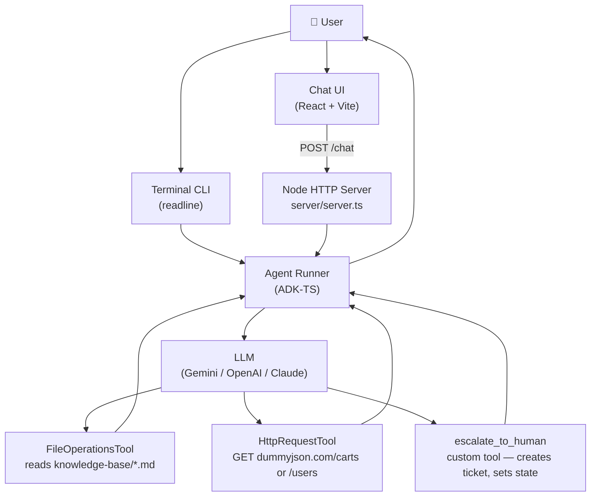

<div align="center">
  
  <br/>
  <h1>Customer Support Agent</h1>
  <b>Demo project for the article "How to Build a Customer Support Agent with ADK-TS"</b>
  <br/>
  <i>ADK-TS · React · Vite · Built-in Tools · Custom Tools · Session State</i>
</div>

---

This is the code demo for the article on the IQ blog:

- [How to Build a Customer Support Agent with ADK-TS](https://blog.iqai.com/)

> **Branch guide:**
>
> - **`starter`** — UI complete, agent stubs in place — start here when following the article
> - **`final`** — Complete implementation: fully working agent with all tools, session state, and error handling

Please give this repo a ⭐ if it was helpful to you!

## Table of Contents

- [Overview](#overview)
- [Features](#features)
- [Architecture](#architecture)
- [Technologies Used](#technologies-used)
- [Prerequisites](#prerequisites)
- [Getting Started](#getting-started)
- [Usage](#usage)
- [License](#license)
- [Additional Resources](#additional-resources)

## Overview

This is a customer support chatbot built with ADK-TS. It covers how to use ADK-TS built-in tools (`FileOperationsTool`, `HttpRequestTool`) alongside a fully custom tool built with `createTool`, with session state wired in throughout. The project runs as a web chat UI and as an interactive terminal CLI.

## Features

- **Policy Q&A** — answers shipping, return, payment, and membership questions from local markdown files
- **Live order lookup** — fetches real-time cart/order data by order number
- **Account lookup** — retrieves user details by user ID
- **Human escalation** — generates a timestamped ticket ID and flags the session when the agent can't resolve an issue
- **Two run modes** — web chat UI or interactive terminal CLI
- **Multi-model support** — works with Gemini, OpenAI, or Anthropic Claude via a single env var swap
- **Session state** — tracks escalation status across the conversation using ADK-TS state

## Architecture



## Technologies Used

- **[ADK-TS](https://adk.iqai.com/)** – TypeScript framework for building AI agents
- **[React 19](https://react.dev/)** – Chat UI
- **[Vite](https://vite.dev/)** – Frontend dev server and bundler
- **[Zod](https://zod.dev/)** – Schema validation for custom tool inputs
- **[Google AI (Gemini)](https://aistudio.google.com/)** – Default LLM provider (OpenAI and Anthropic also supported)

## Prerequisites

- Node.js 22+ — [Download Node.js](https://nodejs.org/en/download/)
- A package manager of your choice (pnpm, npm, yarn, etc.)
- An API key for your chosen model provider:
  - [Google AI Studio](https://aistudio.google.com/app/api-keys) (default — Gemini)
  - [OpenAI](https://platform.openai.com/api-keys)
  - [Anthropic](https://console.anthropic.com/)

## Getting Started

1. Clone the repository:

   ```bash
   git clone https://github.com/IQAIcom/customer-support-agent.git
   cd customer-support-agent
   ```

2. Install dependencies:

   ```bash
   pnpm install
   ```

3. Set up environment variables:

   ```bash
   cp .env.example .env
   ```

   Add your API key to `.env`:

   ```env
   GOOGLE_API_KEY=your_google_api_key_here
   LLM_MODEL=gemini-2.5-flash
   ```

   To use a different provider, swap the key and model:

   ```env
   # OpenAI
   OPENAI_API_KEY=your_openai_api_key_here
   LLM_MODEL=gpt-4o

   # Anthropic
   ANTHROPIC_API_KEY=your_anthropic_api_key_here
   LLM_MODEL=claude-sonnet-4-6
   ```

4. Start the app:

   **Web chat UI** (server + frontend together):

   ```bash
   pnpm dev:web
   ```

   Open [http://localhost:5173](http://localhost:5173).

   **Terminal CLI** (no UI, just the agent in your terminal):

   ```bash
   pnpm dev
   ```

## Usage

**Web UI** — type a message into the chat box and press Send. Use the example prompt buttons on first load to try common support scenarios.

**CLI** — type your question at the `You:` prompt and press Enter. Type `exit` to quit.

Things to try:

- `What is your return policy?` — agent reads `refund-policy.md` and answers from it
- `How much does shipping cost?` — agent reads `shipping-info.md`
- `Where is my order? My order number is 3` — agent calls the live orders API
- `Look up my account, my user ID is 1` — agent calls the live users API
- `I need to speak to a human agent` — agent creates an escalation ticket and prints it to the server console

## License

MIT — see [LICENSE](./LICENSE).

## Additional Resources

- 📝 [How to Build a Customer Support Agent with ADK-TS](https://blog.iqai.com/)
- 📝 [How to Build Your First AI Agent in TypeScript with ADK-TS](https://blog.iqai.com/build-ai-agent-in-typescript-with-adk-ts/)
- 📚 [ADK-TS Documentation](https://adk.iqai.com/)
- 🛠️ [Built-in Tools Reference](https://adk.iqai.com/docs/framework/tools/built-in-tools)
- 💻 [ADK-TS GitHub Repository](https://github.com/IQAICOM/adk-ts)
- 📋 [Explore ADK-TS Samples](https://github.com/IQAIcom/adk-ts-samples)
